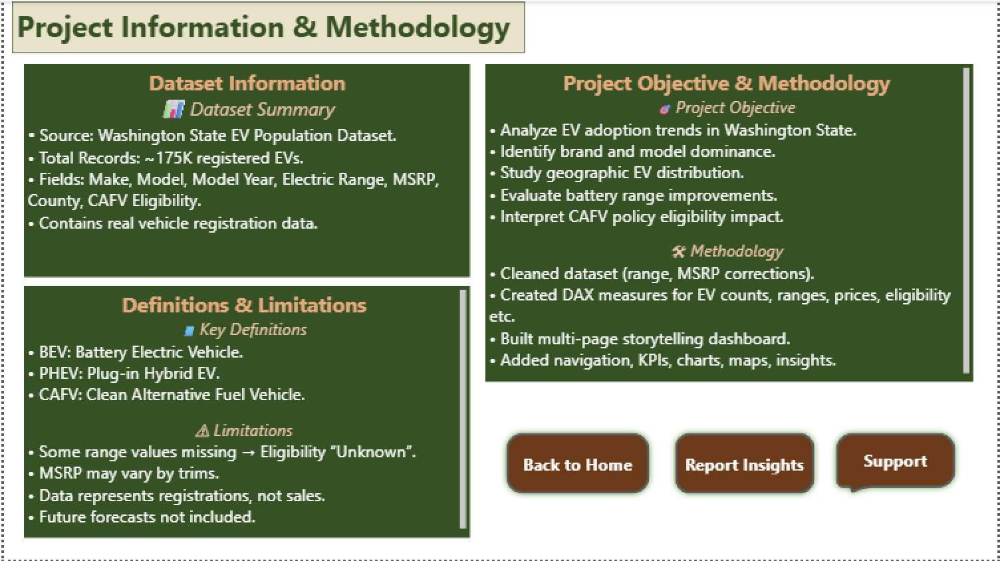
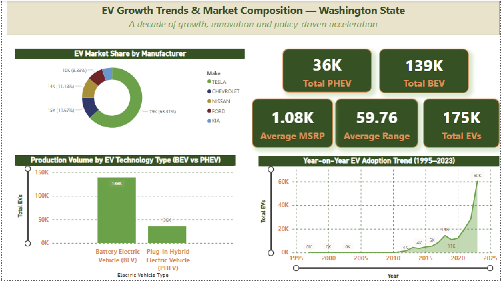
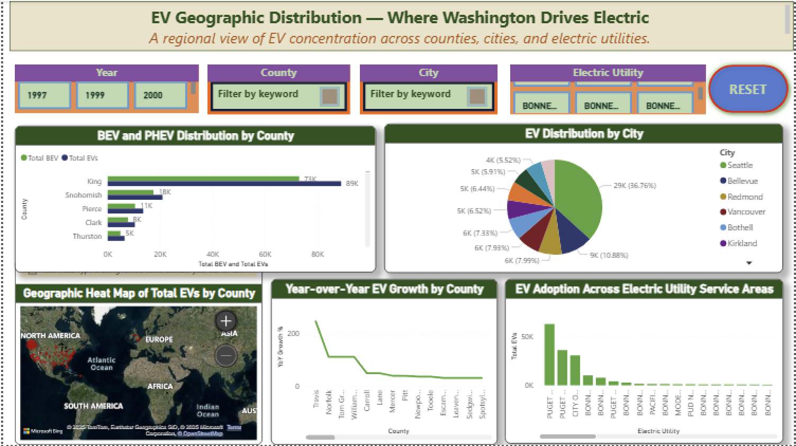
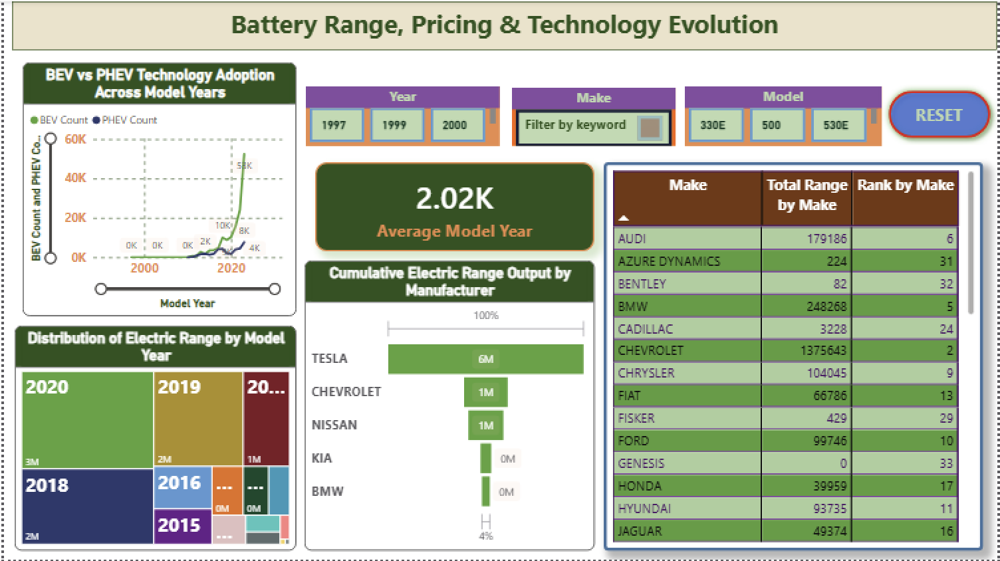
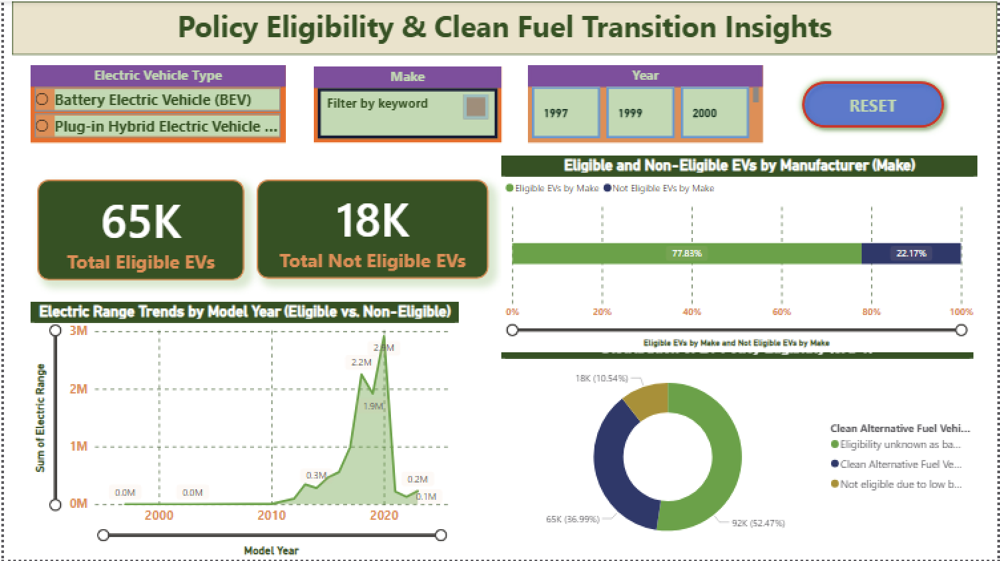
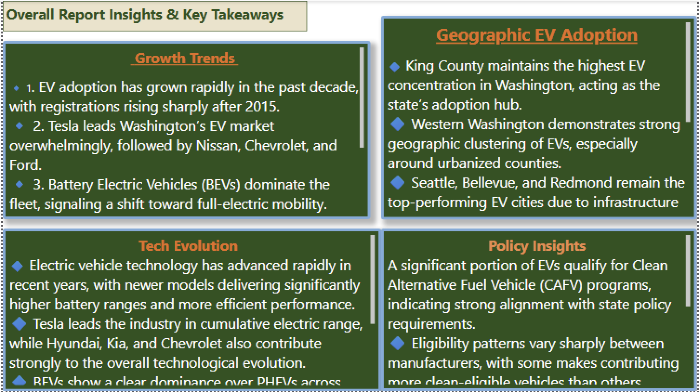
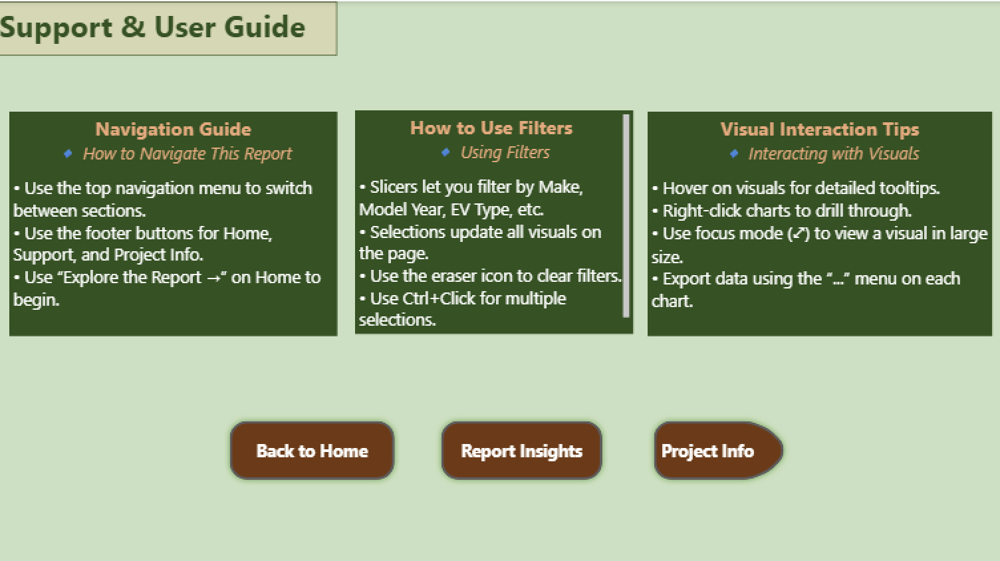

# ⚡ Electric Vehicle Adoption Analysis (Power BI)

## 📖 Overview

This project presents a data-driven analysis of **electric vehicle (EV) adoption trends** using an interactive Power BI dashboard.  
The goal is to understand how electric vehicle adoption is evolving over time and identify key factors influencing this transition.

The dashboard is designed to support **exploratory analysis, insight generation, and data-driven storytelling**.

---

## 🎯 Objectives

- Analyze trends in electric vehicle adoption  
- Identify growth patterns over time  
- Compare adoption across regions and categories  
- Highlight policy and market-level insights  
- Present findings through an interactive Power BI dashboard  

---

## 📊 Dashboard Highlights

- Time-based trends in EV adoption  
- Regional comparison of adoption patterns  
- Growth insights supported by KPIs  
- Policy-level and high-level analytical insights  
- Interactive filters for deeper exploration  

---

## 📸 Dashboard Pages Preview

### 📌 Project Information


### 📊 Dashboard Overview


### 📈 EV Adoption Trends


### 🌍 Regional Analysis


### 📉 Growth Insights


### 🏛️ Policy Insights


### 📌 Report Insights Summary


### 📘 User Guide


---

## 🛠️ Tools Used

- **Power BI Desktop**
- DAX for calculated measures
- Power Query for data transformation
- Interactive visuals and slicers

---

## 📂 Repository Structure


```text
electric-vehicle-adoption-analysis-powerbi/
│
├── PowerBI/
│   └── Electric_car_Adaptation_Analysis_PBI_Project.pbix
│
├── data/        
│   └── processed/     
│
├── images/
│   ├── dashboard-overview.png
│   ├── page1-analysis.png
│   └── insights.png
│
├── docs/
│   └── data_dictionary.md  
│
├── README.md
└── LICENSE   


---

## ▶️ How to View the Dashboard

1. Download the `.pbix` file from the **PowerBI** folder  
2. Open it using **Power BI Desktop**  
3. Use slicers and filters to explore the analysis interactively  

---

## 📌 Notes

- This project focuses on **analytical insights**, not forecasting  
- Findings depend on the scope and quality of the underlying dataset  
- Designed for learning, analysis, and storytelling purposes  

---

## 👩‍💻 Author

**Tabassum Unnisa**  
Data Science | Analytics | Power BI  

This project is part of my journey in applying data analytics and visualization tools to real-world problems.

---
